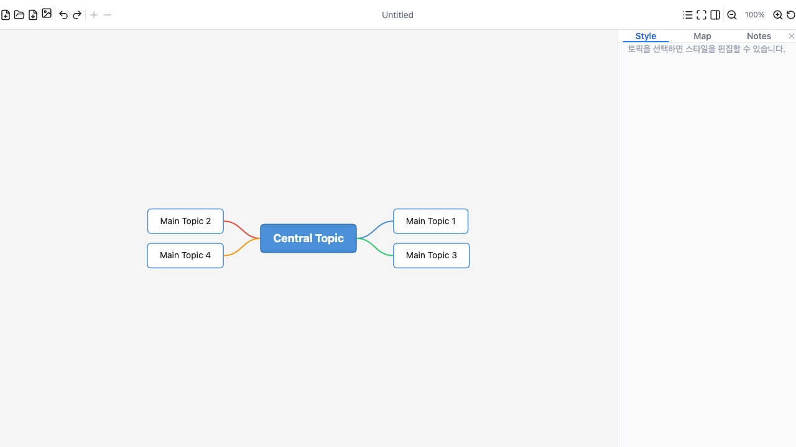
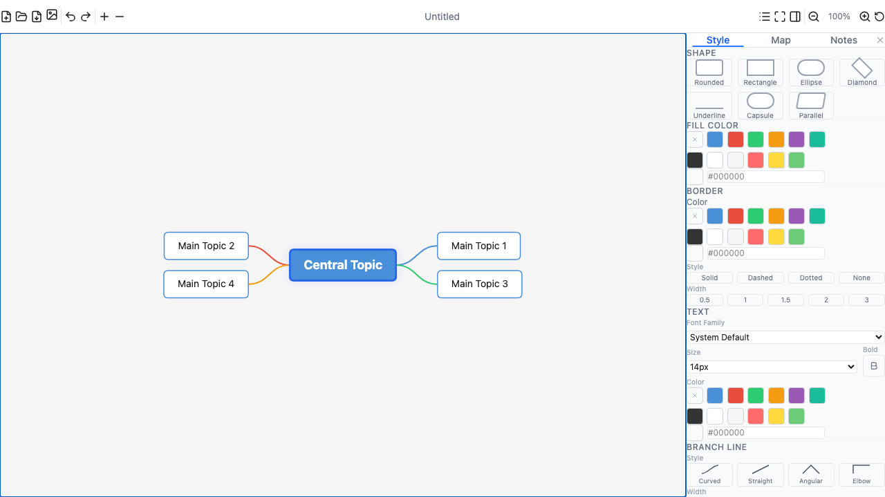
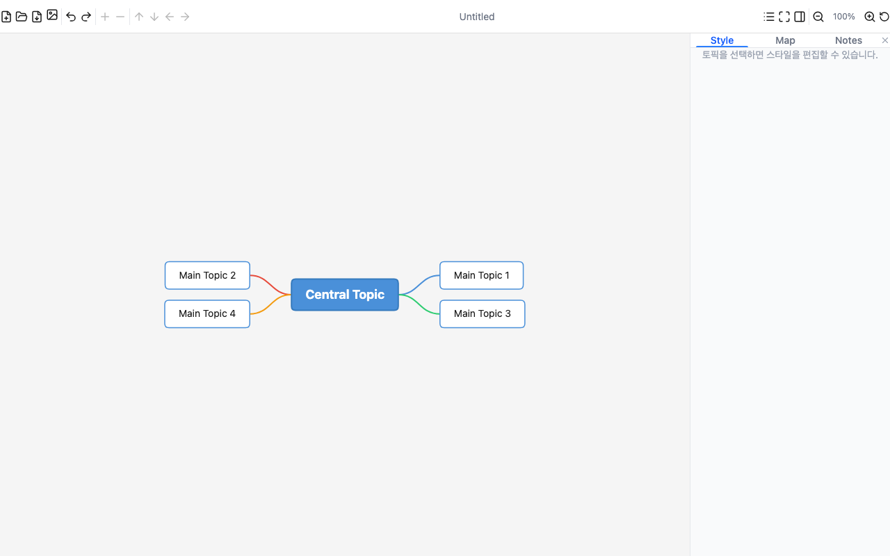
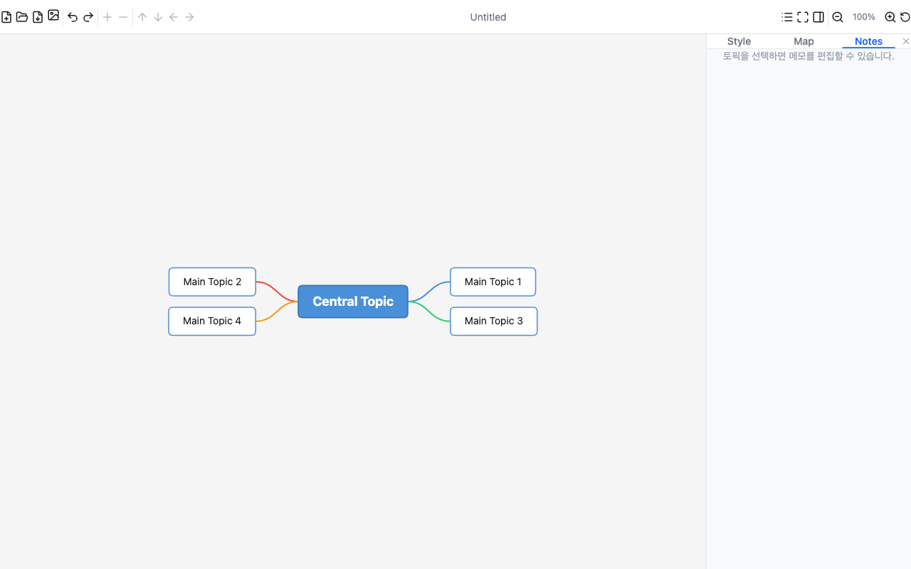
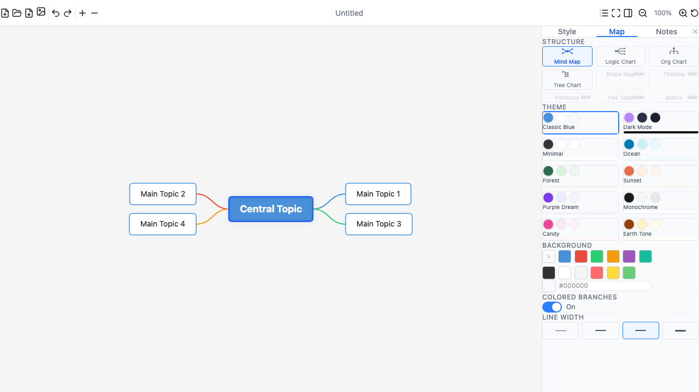
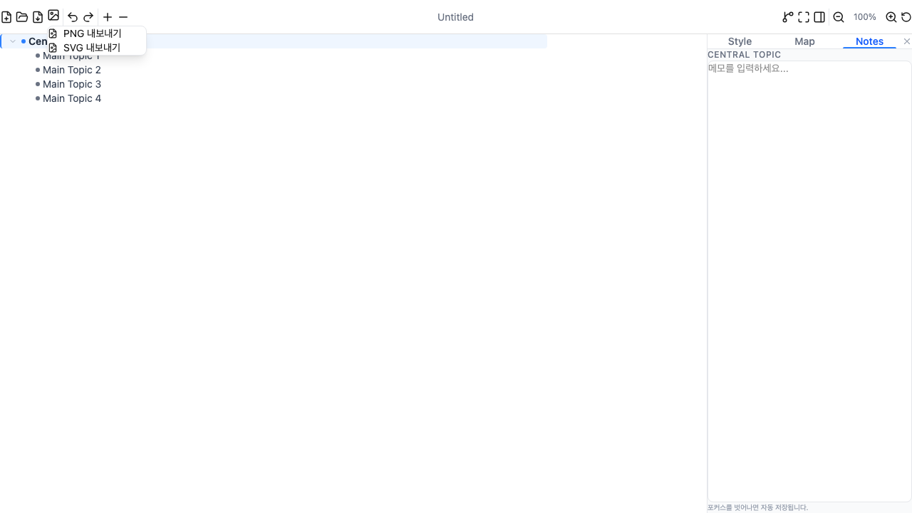
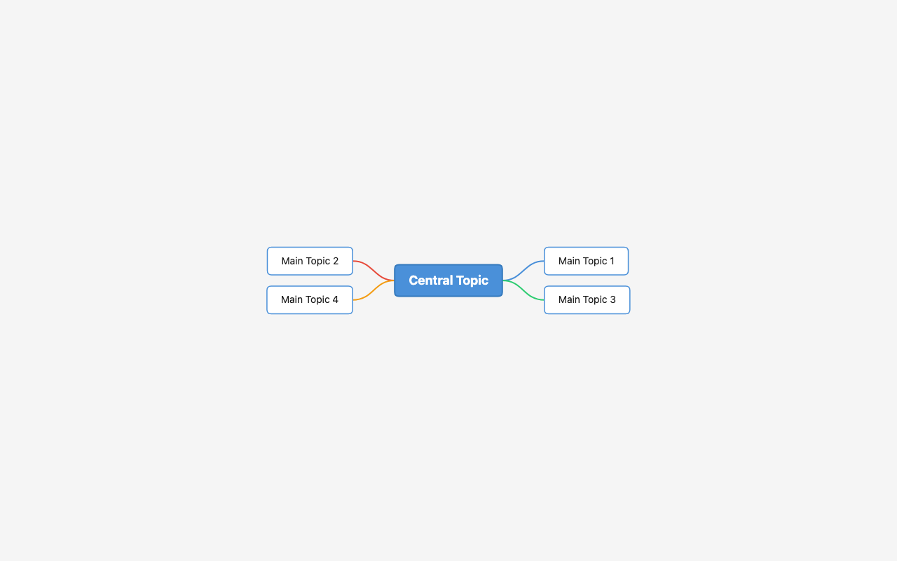
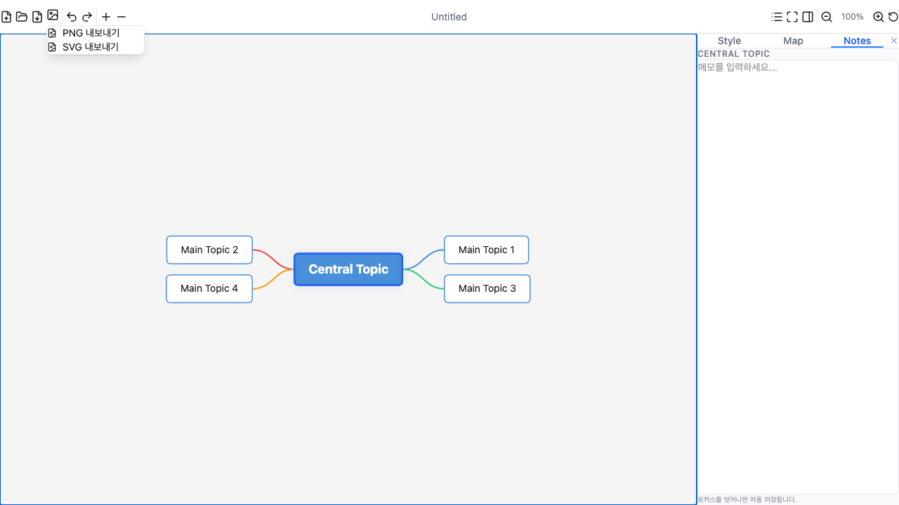

# MAX Mind 사용자 매뉴얼

> 빠르고 가벼운 데스크톱 마인드맵 애플리케이션

---

## 목차

1. [소개](#소개)
2. [시작하기](#시작하기)
3. [화면 구성](#화면-구성)
4. [기본 사용법](#기본-사용법)
5. [토픽 편집](#토픽-편집)
6. [스타일 꾸미기](#스타일-꾸미기)
7. [마커 (아이콘)](#마커-아이콘)
8. [메모 기능](#메모-기능)
9. [맵 구조 변경](#맵-구조-변경)
10. [테마 변경](#테마-변경)
11. [아웃라이너 뷰](#아웃라이너-뷰)
12. [Zen Mode (집중 모드)](#zen-mode-집중-모드)
13. [내보내기](#내보내기)
14. [검색 기능](#검색-기능)
15. [시트 관리](#시트-관리)
16. [관계선](#관계선)
17. [하이퍼링크](#하이퍼링크)
18. [커맨드 팔레트](#커맨드-팔레트)
19. [파일 관리](#파일-관리)
20. [키보드 단축키 전체 목록](#키보드-단축키-전체-목록)
21. [경쟁 제품 대비 장점](#경쟁-제품-대비-장점)
22. [FAQ](#faq)

---

## 소개

MAX Mind는 macOS/Windows/Linux에서 동작하는 네이티브 데스크톱 마인드맵 애플리케이션입니다. XMind 파일 형식(.xmind)과 완벽하게 호환되며, 빠른 Canvas 렌더링과 직관적인 UI를 제공합니다.

### 주요 특징

- **네이티브 데스크톱 앱** — 브라우저 없이 독립 실행, 빠른 시작
- **XMind 호환** — .xmind 파일 열기/저장 지원
- **4가지 맵 구조** — Mind Map, Logic Chart, Org Chart, Tree Chart
- **10가지 테마** — 클릭 한 번으로 전체 디자인 변경
- **Zen Mode** — 집중 모드로 방해 요소 제거
- **아웃라이너 뷰** — 맵과 텍스트 목록 간 원클릭 전환
- **다양한 내보내기** — PNG/SVG/PDF/Markdown 4가지 형식 지원
- **마커 시스템** — 우선순위, 진행상태, 플래그 아이콘
- **메모 기능** — 토픽별 상세 메모 작성
- **검색** — ⌘F로 토픽 이름 즉시 검색
- **다중 시트** — 하나의 파일에 여러 맵을 탭으로 관리
- **관계선** — 서로 다른 브랜치 토픽 간 연결선
- **하이퍼링크** — 토픽에 URL 링크 첨부
- **커맨드 팔레트** — ⌘K로 모든 명령에 즉시 접근
- **드래그앤드롭** — 노드를 마우스로 드래그하여 위치 이동
- **이미지 첨부** — 노드에 이미지를 추가하여 시각적 표현 강화
- **클립보드 이미지 붙여넣기** — ⌘V로 클립보드 이미지를 노드에 바로 붙여넣기
- **텍스트 서식** — 볼드/이탤릭/취소선/밑줄/텍스트 정렬 지원
- **팝업 색상 피커** — 56색 그리드에서 색상 선택

---

## 시작하기

### 설치 및 실행

```bash
# 의존성 설치
npm install

# 개발 모드 실행 (브라우저)
npm run dev

# 데스크톱 앱 실행 (Tauri)
npx tauri dev
```

### 첫 실행 시 화면

앱을 실행하면 기본 마인드맵이 표시됩니다:



화면은 크게 세 영역으로 구성됩니다:
- **상단**: 툴바 (파일, 편집, 뷰 컨트롤)
- **중앙**: 캔버스 (마인드맵 표시 영역)
- **우측**: 사이드바 (Style / Map / Notes 탭)

---

## 화면 구성

### 툴바 (상단 바)

왼쪽부터 순서대로:

| 아이콘 | 기능 | 단축키 |
|--------|------|--------|
| 📄 New | 새 파일 생성 | `⌘N` |
| 📂 Open | .xmind 파일 열기 | `⌘O` |
| 💾 Save | 파일 저장 | `⌘S` |
| 🖼 Export | PNG/SVG 이미지 내보내기 | — |
| ↩ Undo | 실행 취소 | `⌘Z` |
| ↪ Redo | 다시 실행 | `⌘⇧Z` |
| ＋ Add | 하위 토픽 추가 | `Tab` |
| − Delete | 토픽 삭제 | `Delete` |

중앙: **파일명** 표시 (수정 시 `*` 표시)

오른쪽:

| 아이콘 | 기능 | 단축키 |
|--------|------|--------|
| ☰ View | 맵/아웃라이너 뷰 전환 | — |
| 🧘 Zen | Zen Mode (집중 모드) | `⌘⇧F` |
| 📌 Sidebar | 사이드바 표시/숨김 | — |
| 🔍 Zoom | 줌 인/아웃/리셋 | `⌘+` / `⌘-` / `⌘0` |

### 사이드바 (우측 패널)

세 개의 탭으로 구성됩니다:

- **Style** — 선택한 토픽의 모양, 색상, 폰트, 선 스타일, 마커 편집
- **Map** — 맵 구조(레이아웃) 변경, 테마 선택, 배경색 설정
- **Notes** — 선택한 토픽에 메모 작성

---

## 기본 사용법

### 캔버스 조작

| 동작 | 방법 |
|------|------|
| **화면 이동 (팬)** | 빈 영역을 드래그 또는 마우스 휠 스크롤 |
| **줌 인/아웃** | `⌘` + 마우스 휠 또는 `Ctrl` + 마우스 휠 |
| **뷰 리셋** | 툴바 ↺ 버튼 또는 `⌘0` |
| **토픽 선택** | 토픽 클릭 |
| **다중 선택 (클릭)** | `⌘` + 클릭 (또는 `Ctrl` + 클릭) |
| **다중 선택 (드래그)** | 빈 영역에서 마우스 드래그 — 파란 점선 사각형으로 영역 내 노드 일괄 선택 |
| **선택 해제** | 빈 영역 클릭 또는 `Esc` |

### 토픽 탐색 (키보드)

방향키를 사용하여 토픽 간 빠르게 이동할 수 있습니다:

| 키 | 동작 |
|----|------|
| `↑` / `↓` | 시각적으로 가장 가까운 상/하 노드로 이동 (공간 기반 탐색) |
| `←` / `→` | 부모/자식 토픽으로 이동 |
| `Space` | 하위 토픽 접기/펼치기 |

> **참고**: 위/아래 방향키는 트리 구조가 아닌 화면상의 시각적 위치를 기준으로 가장 가까운 노드로 이동합니다. 예를 들어 Logic Chart에서 같은 depth의 노드 간에 자연스럽게 이동할 수 있습니다.

### 중심 노드 드래그

중심(루트) 노드를 마우스로 드래그하면 전체 맵이 이동합니다.

---

## 토픽 편집

### 토픽 추가

| 동작 | 방법 |
|------|------|
| **하위 토픽 추가** | 토픽 선택 후 `Tab` 키 |
| **형제 토픽 추가** | 토픽 선택 후 `Enter` 키 |
| **마우스로 추가** | 토픽에 마우스를 올리면 나타나는 `+` 버튼 클릭 |

새 토픽이 추가되면 자동으로 편집 모드에 진입합니다.

### 토픽 이름 변경

1. 토픽을 **더블클릭**하거나 `F2` 키를 누릅니다
2. 텍스트를 입력합니다
3. **`⌘Enter`** (Cmd+Enter)로 줄바꿈을 추가하여 여러 줄 입력이 가능합니다
4. `Enter`로 확정하거나 `Esc`로 취소합니다

### 토픽 삭제

- 토픽 선택 후 `Delete` 또는 `Backspace` 키
- 삭제 후 자동으로 가장 가까운 노드가 선택됩니다 (다음 형제 → 이전 형제 → 부모 순)
- 노드에 이미지가 있으면 `Delete` 키로 이미지를 먼저 삭제하고, 이미지가 없으면 노드를 삭제합니다
- 중심 토픽(Central Topic)은 삭제할 수 없습니다

### 토픽 이동

토픽을 드래그하여 다른 부모 토픽으로 이동할 수 있습니다.

### 토픽 접기/펼치기

- 토픽 선택 후 `Space` 키
- 또는 토픽 옆의 접기 인디케이터 클릭
- 접힌 상태에서는 숫자 뱃지로 하위 토픽 개수를 표시합니다

```
접힌 상태:  ┌──────────┐ (3)
            │Main Topic│●
            └──────────┘

펼친 상태:  ┌──────────┐     ┌─────────┐
            │Main Topic│─────│Sub Top.1│
            └──────────┘  │  └─────────┘
                          │  ┌─────────┐
                          └──│Sub Top.2│
                             └─────────┘
```

---

## 스타일 꾸미기

토픽을 선택하면 사이드바 **Style** 탭에서 다양한 스타일을 편집할 수 있습니다.

> **다중 선택 일괄 스타일 적용**: 여러 노드를 선택한 상태에서 스타일을 변경하면 선택된 모든 노드에 동시에 적용됩니다. `⌘+클릭` 또는 드래그 선택으로 여러 노드를 선택한 후 글꼴, 색상, 취소선 등을 한 번에 변경할 수 있습니다.



### 토픽 모양 (Shape)

7가지 모양을 선택할 수 있습니다: Rounded, Rectangle, Ellipse, Diamond, Underline, Capsule, Parallelogram

### 이미지 첨부 (Image)

노드에 이미지를 추가하여 시각적으로 풍부한 마인드맵을 만들 수 있습니다.

**추가 방법:**
- Style 탭 → IMAGE 섹션 → "이미지 추가" 버튼 클릭 → 파일 선택
- 또는 클립보드에 이미지를 복사한 후 노드 선택 → `⌘V`로 바로 붙여넣기

**삭제 방법:**
- 이미지가 있는 노드 선택 후 `Delete` 키 (이미지만 삭제, 노드는 유지)
- 또는 Style 탭 → IMAGE 섹션 → "삭제" 버튼 클릭

이미지는 노드 상단에 텍스트 위에 표시되며, 노드 크기가 자동으로 조정됩니다. 최대 800px로 리사이즈되어 파일 크기를 관리합니다.

### 색상 설정

- **채우기 색상** (Fill Color) — 토픽 배경색
- **테두리 색상** (Border Color) — 외곽선 색상
- **텍스트 색상** (Font Color) — 글자 색상
- **연결선 색상** (Line Color) — 브랜치 선 색상

색상 swatch 버튼을 클릭하면 **팝업 색상 피커**가 열립니다:
- 8열 x 7행 (56색) 색상 그리드 — 그레이스케일, 빨강, 주황, 노랑, 초록, 파랑, 보라
- HEX 코드 직접 입력
- "None" 옵션으로 투명 설정
- 팝업 바깥 클릭 또는 `Esc`로 닫기

### 테두리 스타일

| 스타일 | 설명 |
|--------|------|
| Solid | 실선 (기본) |
| Dashed | 점선 |
| Dotted | 도트 |
| None | 테두리 없음 |

두께는 0.5 / 1 / 1.5 / 2 / 3 중 선택 가능합니다.

### 텍스트 설정

- **폰트 패밀리**: System Default, Arial, Georgia, Courier New, Verdana, Times New Roman, Helvetica, Pretendard, Noto Sans KR
- **폰트 크기**: 10px ~ 48px
- **텍스트 서식**:
  - **B** (Bold) — 굵게
  - **I** (Italic) — 기울임
  - **S** (Strikethrough) — 취소선
  - **U** (Underline) — 밑줄
  - 여러 서식을 동시에 적용 가능 (예: 굵게 + 기울임 + 밑줄)
- **텍스트 정렬**: 좌측 / 중앙 / 우측
- **폰트 색상**: 팝업 색상 피커로 선택

### 연결선 스타일

| 스타일 | 설명 |
|--------|------|
| Curved | 부드러운 곡선 (기본) |
| Straight | 직선 |
| Angular | 꺾은선 |
| Elbow | L자형 선 |

---

## 마커 (아이콘)

토픽에 시각적 아이콘을 추가하여 상태나 중요도를 표시할 수 있습니다.

### 사용 방법

1. 토픽을 선택합니다
2. 사이드바 **Style** 탭에서 아래로 스크롤하여 **MARKERS** 섹션을 찾습니다
3. 원하는 마커를 클릭합니다 (같은 마커를 다시 클릭하면 제거)



### 마커 종류

**우선순위** — 작업의 중요도를 1~5단계로 표시

| 마커 | 의미 |
|------|------|
| 1️⃣ | 1순위 (가장 높음) |
| 2️⃣ | 2순위 |
| 3️⃣ | 3순위 |
| 4️⃣ | 4순위 |
| 5️⃣ | 5순위 (가장 낮음) |

**진행 상태** — 작업 진행 현황 표시

| 마커 | 의미 |
|------|------|
| 🔵 | 시작 |
| 🟡 | 진행중 |
| 🟢 | 완료 |
| 🔴 | 보류 |

**플래그** — 색상별 플래그로 분류

| 마커 | 의미 |
|------|------|
| 🚩 | 빨강 플래그 |
| 🔶 | 주황 플래그 |
| ✅ | 초록 플래그 |
| 🔷 | 파랑 플래그 |
| 💜 | 보라 플래그 |

**기호** — 다용도 아이콘

| 마커 | 의미 |
|------|------|
| ⭐ | 별 (즐겨찾기) |
| ❤️ | 하트 (좋아요) |
| 💡 | 아이디어 |
| ❓ | 질문 |
| ⚠️ | 경고 |
| ✔️ | 확인 |
| ❌ | 취소 |
| 🔥 | 중요/긴급 |

> **참고**: 같은 그룹 내에서는 하나의 마커만 선택됩니다. 예를 들어 우선순위 1을 선택한 후 우선순위 3을 선택하면 1이 자동으로 제거됩니다. 서로 다른 그룹의 마커는 동시에 사용 가능합니다.

---

## 메모 기능

각 토픽에 상세한 텍스트 메모를 추가할 수 있습니다. 마인드맵의 토픽명은 짧게 유지하면서, 구체적인 내용은 메모에 기록하는 방식입니다.

### 사용 방법

1. 토픽을 선택합니다
2. 사이드바에서 **Notes** 탭을 클릭합니다
3. 텍스트 영역에 메모를 입력합니다
4. 포커스를 벗어나면(다른 곳 클릭) **자동 저장**됩니다



### 메모 인디케이터

메모가 있는 토픽에는 캔버스에서 우측 상단에 작은 **노란색 메모 아이콘**이 표시되어 한눈에 식별할 수 있습니다.

---

## 맵 구조 변경

사이드바 **Map** 탭에서 맵의 레이아웃 구조를 변경할 수 있습니다.

### 지원 구조

| 구조 | 설명 | 용도 |
|------|------|------|
| **Mind Map** | 중심에서 양쪽으로 펼침 | 브레인스토밍, 아이디어 정리 |
| **Logic Chart** | 왼쪽에서 오른쪽으로 분기 (bracket 연결선, 레벨별 균일 너비) | 논리적 흐름, 의사결정 트리, 일정 관리 |
| **Org Chart** | 위에서 아래로 내려감 | 조직도, 계층 구조 |
| **Tree Chart** | 트리 형태로 아래로 분기 | 파일 구조, 분류 체계 |



구조를 변경하면 동일한 데이터가 새로운 레이아웃으로 즉시 재배치됩니다.

---

## 테마 변경

사이드바 **Map** 탭에서 10가지 프리셋 테마를 선택할 수 있습니다.

| 테마 | 특징 |
|------|------|
| **Classic Blue** | 파란색 기반 기본 테마 (기본값) |
| **Dark Mode** | 어두운 배경의 다크 테마 |
| **Minimal** | 깔끔한 미니멀 디자인 |
| **Ocean** | 바다 느낌의 블루/그린 톤 |
| **Forest** | 자연 느낌의 그린 톤 |
| **Sunset** | 따뜻한 노을 느낌 |
| **Purple Dream** | 보라색 기반 몽환적 테마 |
| **Monochrome** | 흑백 단색 테마 |
| **Candy** | 밝고 화사한 캔디 컬러 |
| **Earth Tone** | 차분한 어스 톤 |

테마를 변경하면 중심 토픽, 주 토픽, 하위 토픽의 색상, 폰트, 연결선 스타일이 일괄 변경됩니다. 개별 토픽의 커스텀 스타일은 테마 위에 덮어쓰기로 유지됩니다.

---

## 아웃라이너 뷰

마인드맵을 텍스트 기반 리스트로 전환하여 볼 수 있습니다.

### 사용 방법

1. 툴바에서 **☰ (Outliner View)** 버튼을 클릭합니다
2. 마인드맵이 들여쓰기된 텍스트 목록으로 표시됩니다
3. 다시 맵 뷰로 돌아가려면 같은 위치의 **🔀 (Map View)** 버튼을 클릭합니다

### 아웃라이너 화면 구성



### 아웃라이너에서 편집

맵 뷰와 동일한 키보드 단축키가 모두 지원됩니다:

| 키 | 동작 |
|----|------|
| `Tab` | 선택한 토픽 아래에 하위 토픽 추가 |
| `Enter` | 형제 토픽 추가 |
| `Delete` | 토픽 삭제 |
| `F2` 또는 더블클릭 | 토픽 이름 편집 |
| `Space` | 하위 항목 접기/펼치기 |

마우스를 토픽 위에 올리면 `+` (추가)와 `🗑` (삭제) 버튼이 나타납니다.

### 활용 팁

- **회의록 작성**: 아웃라이너로 빠르게 내용을 입력한 후, 맵 뷰로 전환하여 시각적으로 정리
- **문서 개요 작성**: 아웃라이너에서 문서 구조를 잡은 뒤, 맵으로 전체 구조 확인
- **양쪽 뷰의 데이터는 완전히 동기화**되어 있어 어디서 편집하든 즉시 반영됩니다

---

## Zen Mode (집중 모드)

Zen Mode는 툴바와 사이드바를 모두 숨기고 마인드맵에만 집중할 수 있는 모드입니다.

### 진입 방법

- 툴바에서 **🧘 Zen Mode** 버튼 클릭
- 또는 `⌘⇧F` (Cmd+Shift+F) 단축키

### Zen Mode 화면



툴바와 사이드바가 모두 사라지고 마인드맵만 전체화면으로 표시됩니다.

### 미니 컨트롤 바

화면 상단에 마우스를 올리면 줌 컨트롤과 종료 버튼이 있는 미니 컨트롤 바가 나타납니다.

### 종료 방법

- `Esc` 키
- 미니 컨트롤 바의 `✕` 버튼 클릭

### 활용 팁

- **프레젠테이션**: 회의 중 마인드맵을 보여줄 때 UI 없이 깔끔하게 표시
- **집중 작업**: 브레인스토밍 시 UI 방해 요소 제거
- **키보드 단축키가 모두 동작**하므로 토픽 추가/편집/삭제가 가능합니다

---

## 내보내기

마인드맵을 다양한 형식으로 내보내어 문서, 프레젠테이션, 메신저 등에서 활용할 수 있습니다.

### 사용 방법

1. 툴바에서 **🖼 Export** 버튼을 클릭합니다
2. 드롭다운 메뉴에서 형식을 선택합니다



메뉴는 두 섹션으로 구분됩니다:
- **이미지**: PNG, SVG, PDF — 마인드맵을 시각적 이미지로 내보내기
- **문서**: Markdown — 마인드맵을 텍스트 문서로 내보내기

### 지원 형식 비교

| 항목 | PNG | SVG | PDF | Markdown |
|------|-----|-----|-----|----------|
| **용도** | 메신저 공유, SNS | 웹, 프레젠테이션 | 인쇄, 공식 문서 | 개발 문서, 위키 |
| **확대** | 2x 해상도 (Retina) | 무한 확대 | 인쇄 해상도 | — |
| **편집** | 불가 | 일러스트레이터 | 불가 | 텍스트 편집기 |
| **파일 크기** | 중간 | 작음 | 중간 | 매우 작음 |
| **메모 포함** | 아니오 | 아니오 | 아니오 | 포함 (인용 형태) |
| **스타일 유지** | 완벽 | 완벽 | 기본 | 텍스트만 |

### PDF 내보내기

마인드맵을 PDF 파일로 내보냅니다. 맵의 가로/세로 비율에 따라 자동으로 가로 또는 세로 방향이 결정됩니다. 노드의 색상, 모양, 연결선이 모두 포함됩니다.

### Markdown 내보내기

마인드맵의 트리 구조를 Markdown 문서로 변환합니다:
- **중심 토픽** → `# 제목` (H1)
- **주 토픽** → `## 제목` (H2)
- **하위 토픽** → `### 제목` (H3)
- **그 이하** → `- 목록 항목` (들여쓰기)
- **메모** → `> 인용 블록`으로 변환

예시 출력:
```markdown
# Central Topic

## Main Topic 1

### Sub Topic A

- Detail 1
- Detail 2

> 이 토픽에 대한 상세 메모 내용
```

### 내보내기 공통 특징

- 전체 맵이 자동으로 포함됩니다 (줌/팬 상태와 무관)
- 적절한 여백(padding)이 자동 추가됩니다
- 파일명은 현재 파일명을 기반으로 자동 생성됩니다 (예: `mymap.png`, `mymap.pdf`)
- 접힌 토픽의 하위 항목은 이미지 내보내기에 포함되지 않습니다
- Markdown 내보내기는 접힘 상태와 관계없이 모든 토픽을 포함합니다

---

## 검색 기능

대형 마인드맵에서 특정 토픽을 빠르게 찾을 수 있습니다.

### 사용 방법

1. `⌘F` (Cmd+F)를 눌러 검색 바를 엽니다
2. 토픽 이름을 입력하면 실시간으로 매칭되는 토픽이 하이라이트됩니다
3. `Enter`로 다음 결과, `Shift+Enter`로 이전 결과로 이동합니다
4. `Esc`로 검색 바를 닫습니다

검색 바에는 현재 매칭 위치가 "1/5" 형태로 표시되어 전체 결과 수를 한눈에 확인할 수 있습니다.

---

## 시트 관리

하나의 파일에 여러 마인드맵을 탭으로 관리할 수 있습니다. XMind의 다중 시트 기능과 동일합니다.

### 사용 방법

- 시트가 2개 이상일 때 화면 하단에 **시트 탭 바**가 자동으로 나타납니다
- `+` 버튼으로 새 시트를 추가합니다
- 탭을 클릭하여 시트를 전환합니다
- 탭을 더블클릭하면 시트 이름을 변경할 수 있습니다
- 활성 탭의 `×` 버튼으로 시트를 삭제합니다 (최소 1개는 유지)

### 활용 팁

- **프로젝트 기획**: 시트 1에 전체 구조, 시트 2에 상세 일정
- **회의록**: 날짜별로 시트를 분리하여 한 파일에서 관리
- **학습 노트**: 과목별 시트 분리

---

## 관계선

서로 다른 브랜치에 있는 토픽 간의 관계를 시각적으로 연결할 수 있습니다.

### 특징

- 빨간색 점선 곡선으로 두 토픽을 연결합니다
- 화살표 방향으로 관계의 흐름을 표시합니다
- 관계선에 레이블(텍스트)을 추가할 수 있습니다

관계선은 XMind 파일의 관계선 데이터와 호환됩니다.

---

## 하이퍼링크

토픽에 URL 링크를 첨부하여 관련 웹 페이지나 문서에 빠르게 접근할 수 있습니다.

### 사용 방법

1. 토픽을 선택합니다
2. 사이드바 **Style** 탭에서 아래로 스크롤하여 **Hyperlink** 섹션을 찾습니다
3. URL을 입력합니다 (예: `https://example.com`)
4. **열기** 버튼을 클릭하면 브라우저에서 링크가 열립니다

### 링크 인디케이터

하이퍼링크가 있는 토픽에는 캔버스에서 🔗 아이콘이 표시되어 한눈에 식별할 수 있습니다.

---

## 커맨드 팔레트

VS Code 스타일의 커맨드 팔레트로 모든 기능에 키보드만으로 빠르게 접근할 수 있습니다.

### 사용 방법

1. `⌘K` (Cmd+K)를 눌러 커맨드 팔레트를 엽니다
2. 명령어를 검색합니다 (예: "저장", "내보내기", "zen")
3. `↑`/`↓` 화살표로 선택, `Enter`로 실행합니다
4. `Esc`로 닫습니다

### 사용 가능한 명령

| 카테고리 | 명령 |
|----------|------|
| **파일** | 새 파일, 파일 열기, 저장, 다른 이름으로 저장 |
| **편집** | 실행 취소, 다시 실행, 토픽 추가/삭제/편집 |
| **이동** | 위/아래로 이동, 승격, 강등 |
| **보기** | Zen Mode, 아웃라이너 전환, 사이드바 토글, 뷰 리셋 |
| **내보내기** | PNG, SVG, PDF, Markdown |

### 활용 팁

- 마우스 없이 모든 기능을 키보드만으로 사용할 수 있습니다
- 한글/영문 모두 검색 가능합니다
- 각 명령 옆에 단축키가 표시되어 학습에도 도움이 됩니다

---

## 파일 관리

### 새 파일

- 툴바 📄 버튼 또는 `⌘N`
- 기본 마인드맵 구조가 생성됩니다

### 파일 열기

- 툴바 📂 버튼 또는 `⌘O`
- `.xmind` 파일을 선택합니다
- XMind에서 만든 파일도 열 수 있습니다

### 파일 저장

- 툴바 💾 버튼 또는 `⌘S` — 현재 파일에 저장 (새 파일이면 다른 이름으로 저장)
- `⌘⇧S` — 다른 이름으로 저장
- `.xmind` 형식으로 저장됩니다

### 저장하지 않은 변경사항

파일에 변경사항이 있으면 툴바 파일명에 `*` 표시가 나타납니다:

```
파일명 표시:  mymap *    ← 저장되지 않은 변경사항 있음
              mymap      ← 모든 변경사항 저장됨
```

앱 종료 시 저장하지 않은 변경사항이 있으면 확인 다이얼로그가 표시됩니다.

### Undo / Redo

- `⌘Z` — 실행 취소 (최대 100단계)
- `⌘⇧Z` — 다시 실행

---

## 키보드 단축키 전체 목록

### 파일 작업

| 단축키 | 기능 |
|--------|------|
| `⌘N` | 새 파일 |
| `⌘O` | 파일 열기 |
| `⌘S` | 저장 |
| `⌘⇧S` | 다른 이름으로 저장 |
| `⌘Q` | 앱 종료 |

### 편집

| 단축키 | 기능 |
|--------|------|
| `⌘Z` | 실행 취소 |
| `⌘⇧Z` | 다시 실행 |
| `Tab` | 하위 토픽 추가 |
| `Enter` | 형제 토픽 추가 |
| `Delete` / `Backspace` | 이미지 삭제 (이미지 있는 경우) 또는 토픽 삭제 |
| `⌘V` | 토픽 붙여넣기 또는 클립보드 이미지 붙여넣기 |
| `⌘C` | 토픽 복사 |
| `⌘X` | 토픽 잘라내기 |
| `F2` | 토픽 이름 편집 |
| `⌘Enter` | 편집 중 줄바꿈 삽입 (여러 줄 입력) |
| `Space` | 접기/펼치기 |
| `Esc` | 선택 해제 / Zen Mode 종료 |

### 탐색

| 단축키 | 기능 |
|--------|------|
| `↑` / `↓` | 시각적으로 가장 가까운 상/하 노드로 이동 |
| `←` / `→` | 부모/자식 토픽 이동 |
| `⌘=` / `⌘+` | 줌 인 (1.2배씩 단계적 확대) |
| `⌘-` | 줌 아웃 (1.2배씩 단계적 축소) |
| `⌘0` | 뷰 리셋 (100%) |
| `⌘` + 마우스 휠 | 줌 인/아웃 (연속) |

### 검색 및 명령

| 단축키 | 기능 |
|--------|------|
| `⌘F` | 토픽 검색 |
| `⌘K` | 커맨드 팔레트 |

### 노드 이동

| 단축키 | 기능 |
|--------|------|
| `⌥↑` | 형제 토픽 위로 이동 |
| `⌥↓` | 형제 토픽 아래로 이동 |
| `⌥←` | 상위로 승격 |
| `⌥→` | 하위로 강등 |

### 뷰 전환

| 단축키 | 기능 |
|--------|------|
| `⌘⇧F` | Zen Mode 토글 |

---

## 경쟁 제품 대비 장점

### vs XMind

| 항목 | MAX Mind | XMind |
|------|-----------|-------|
| **가격** | 무료 (오픈소스) | 유료 (연 $59.99~) |
| **파일 호환** | .xmind 완벽 호환 | 자체 형식 |
| **시작 속도** | 1초 이내 | 5~10초 |
| **메모리 사용** | ~100MB | ~500MB+ |
| **Zen Mode** | 지원 | 지원 |
| **아웃라이너** | 지원 (원클릭 전환) | 지원 |
| **커스터마이징** | 오픈소스로 자유로운 확장 | 제한적 |
| **구독 없음** | 영구 무료 | 구독 필요 |

**MAX Mind의 핵심 차별점**: XMind 파일을 그대로 열고 저장할 수 있으면서 무료이고, 네이티브 앱이라 훨씬 빠릅니다.

### vs Miro / MindMeister (웹 기반)

| 항목 | MAX Mind | Miro / MindMeister |
|------|-----------|---------------------|
| **오프라인** | 완전한 오프라인 지원 | 인터넷 필수 |
| **속도** | 네이티브 Canvas 렌더링 | 브라우저 기반 (느림) |
| **개인정보** | 로컬 파일만 사용 | 클라우드 업로드 필요 |
| **가격** | 무료 | 유료 (팀 기능) |
| **파일 형식** | 표준 .xmind | 독자 형식 (잠금) |
| **설치** | 데스크톱 앱 | 브라우저 의존 |
| **대용량 맵** | 빠른 Canvas 렌더링 | DOM 기반으로 느려짐 |

**MAX Mind의 핵심 차별점**: 인터넷 없이 동작하고, 데이터가 로컬에만 저장되므로 개인정보 보호에 강합니다. 네이티브 Canvas 렌더링으로 수백 개 노드에서도 부드럽습니다.

### vs FreeMind / Freeplane (오픈소스)

| 항목 | MAX Mind | FreeMind / Freeplane |
|------|-----------|----------------------|
| **기술 스택** | 최신 (React + Tauri) | Java (Swing) |
| **UI 디자인** | 현대적, 직관적 | 구식 UI |
| **테마** | 10가지 프리셋 | 제한적 |
| **파일 형식** | .xmind (업계 표준) | .mm (독자 형식) |
| **Zen Mode** | 지원 | 미지원 |
| **아웃라이너** | 원클릭 전환 | 미지원 |
| **내보내기** | PNG/SVG/PDF/Markdown | PNG만 |
| **앱 크기** | ~15MB | ~50MB (JRE 포함) |

**MAX Mind의 핵심 차별점**: 최신 기술 스택으로 만들어진 현대적 UI, 가볍고 빠른 실행, 업계 표준 XMind 형식 지원.

### MAX Mind만의 고유 장점 요약

1. **무료 + XMind 호환** — 유일하게 .xmind 파일을 무료로 완벽 지원
2. **초경량 네이티브** — Tauri 기반으로 Electron 대비 메모리 1/5, 시작 속도 5배
3. **프라이버시** — 클라우드 없음, 데이터는 내 컴퓨터에만 존재
4. **듀얼 뷰** — 맵과 아웃라이너 간 원클릭 전환
5. **오픈소스** — 자유로운 커스터마이징과 확장 가능

---

## FAQ

**Q: XMind에서 만든 파일을 열 수 있나요?**
A: 네, .xmind 파일을 완벽하게 열고 편집하고 다시 저장할 수 있습니다. 원본 데이터도 보존됩니다.

**Q: 맵이 너무 커서 전체가 안 보여요.**
A: `⌘0`을 눌러 뷰를 리셋하거나, `⌘` + 마우스 휠로 줌 아웃하세요.

**Q: 내보내기한 이미지가 흐릿해요.**
A: PNG 내보내기는 기본 2x 해상도로 생성됩니다. 더 선명한 이미지가 필요하면 SVG 형식을 사용하세요.

**Q: Zen Mode에서 편집할 수 있나요?**
A: 네, 모든 키보드 단축키가 동작합니다. `Tab`으로 토픽 추가, 더블클릭으로 편집 등 일반 모드와 동일합니다.

**Q: 여러 시트(탭)를 사용할 수 있나요?**
A: 네, 지원됩니다. 화면 하단에 시트 탭 바가 표시되며, `+` 버튼으로 새 시트를 추가하고 탭을 클릭하여 전환할 수 있습니다.

**Q: 협업 기능이 있나요?**
A: 현재는 로컬 전용입니다. 파일을 공유하려면 .xmind 파일을 직접 전달하거나 PNG/SVG로 내보내기하세요.

---

*MAX Mind v0.1.0 | 마지막 업데이트: 2026-03-22*
